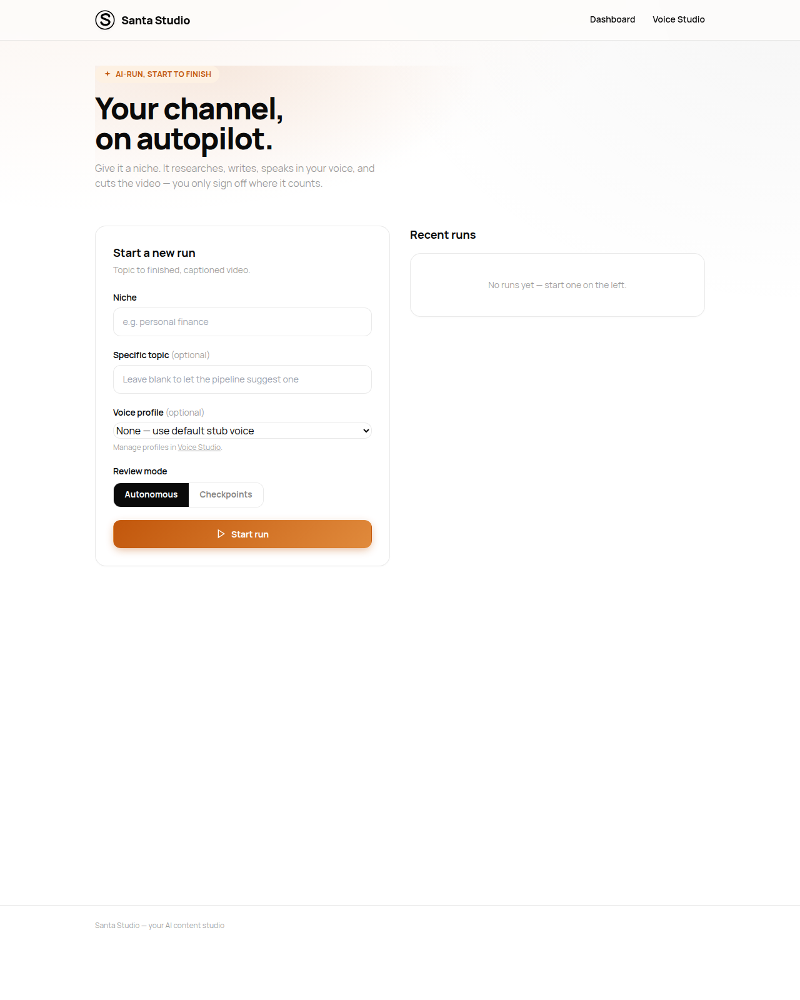
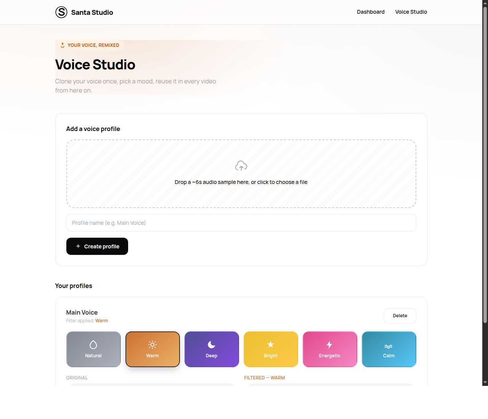
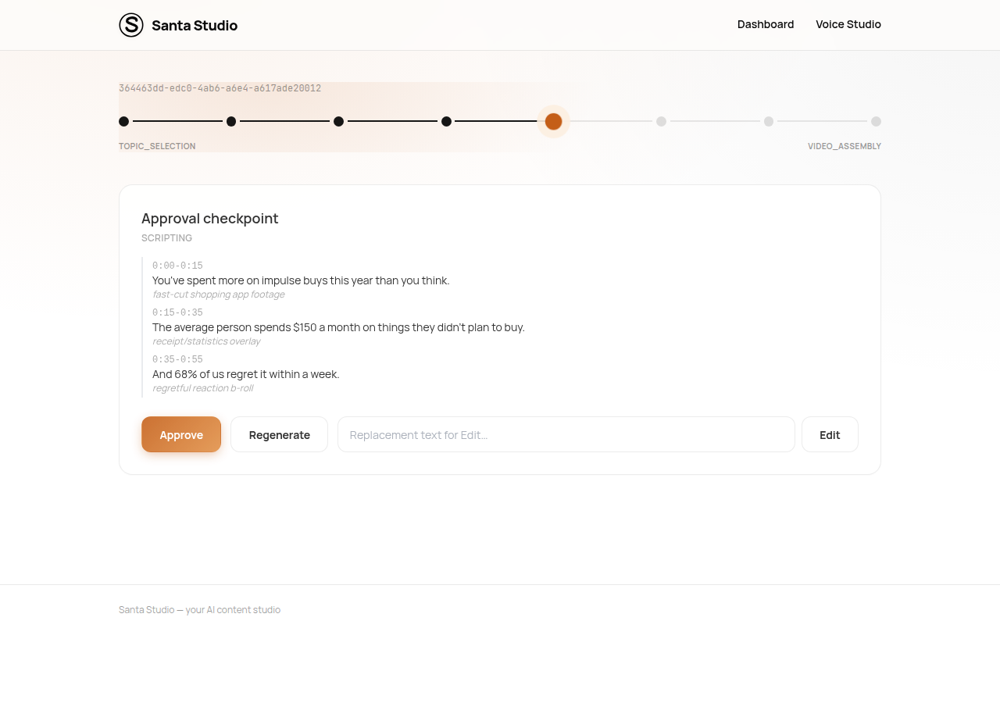

<div align="center">
  

  # Santa Studio

  **An autonomous, multi-agent AI studio that turns a topic into a finished, captioned YouTube video** — research, script, cloned voice, visuals, and assembly, orchestrated end-to-end, with a human approving only where it actually matters.

  
  
  
  
</div>

---

## What this is

Santa Studio is a personal project exploring **agentic pipeline design**: a
state machine orchestrates a chain of independent agents (research →
fact-check → script → voice → visuals → assembly), each one a pure
function with a strict input/output contract, with every external AI
capability (LLM, TTS, stock media, captions) swappable behind an
abstract provider interface — so replacing Claude with another model, or
Pexels with another stock library, is a one-line config change, not a
rewrite.

The same backend is exposed through **four different front ends** — CLI,
Telegram bot, a Streamlit prototype, and a fully custom FastAPI web app —
without duplicating a single line of pipeline logic between them.

## Screenshots

| Dashboard | Voice Studio |
|---|---|
|  |  |

**Run in progress** — animated stage tracker, live approval gate with real content (not a JSON dump):



## Highlights

- **Provider abstraction from day one.** Every AI capability (`LLMProvider`, `VoiceProvider`, `VisualProvider`, `CaptionProvider`) is an ABC resolved through a config-driven registry — agents never import a concrete implementation.
- **A pluggable human-in-the-loop layer.** The same `ApprovalHandler` interface backs a terminal prompt, Telegram inline buttons, and a web UI — approvals, edits, and regenerations work identically across all three.
- **A dual execution model.** `PipelineManager.run()` is a blocking loop for the CLI; `PipelineManager.step()` advances one unit of work at a time for callers that can't block on `input()` — the web app (which can't block a request) and the Telegram bot (which has to stay responsive to incoming updates while a run advances on a background thread).
- **Full pipeline from a chat window.** The Telegram bot is not just an approval channel — `/newvideo` collects niche, topic, length, voice profile, and review mode via replies and inline buttons, a voice note becomes a new cloned voice profile, `/runs` resumes an interrupted run, and the finished video arrives as a chat upload.
- **Persistent, reusable voice profiles.** Clone and filter a voice once — six mood-based filter presets (pitch-shift, EQ blend, tempo) — cache the result, reuse it across every future run instead of re-uploading per run.
- **Resumable by design.** Full pipeline state persists to JSON after every transition; a killed run picks back up exactly where it left off.
- **Zero-friction local media pipeline.** No system `ffmpeg` install (or root access) required — resolved automatically via a pip-installed static binary.

## Architecture

```
┌─────────────┐     ┌──────────────────┐     ┌─────────────────────┐
│  Interfaces │────▶│     Manager      │────▶│       Agents         │
│ CLI/Telegram│     │  state machine,  │     │ topic → reference →  │
│  /Web/(app) │◀────│  validate/retry, │◀────│ research → factcheck │
└─────────────┘     │  JSON persistence│     │ → script → voice →   │
                     └──────────────────┘     │  visual → assembler  │
                                               └──────────┬───────────┘
                                                          ▼
                                               ┌─────────────────────┐
                                               │      Providers       │
                                               │ LLM · Voice · Visual │
                                               │      · Caption       │
                                               └─────────────────────┘
```

- **`manager.py`** — the state machine. One agent per pipeline stage,
  output validation, retry-once-then-halt, JSON persistence after every
  transition.
- **`agents/`** — one function per stage, each following
  `run(input_data, config) -> {success, output, error}`.
- **`providers/`** — abstract interfaces + concrete implementations
  (Claude, XTTS-v2, Pexels/Pixabay, Whisper), resolved via
  `providers/registry.py`.
- **`interfaces/`** — `ApprovalHandler` implementations for CLI,
  Telegram, and the web app.
- **`web/`** — the FastAPI app: dashboard, live run view, and voice
  profile studio.

## Tech stack

| Layer | Choice |
|---|---|
| Reasoning | Gemini -> Groq free fallback chain (Claude optional) |
| Voice | gTTS by default; Coqui XTTS-v2 for cloning (non-commercial) |
| Voice filters | pydub (pitch shift, EQ, tempo) |
| Captions | OpenAI Whisper (local) |
| Stock visuals | Pexels API, Pixabay API (fallback) |
| Video assembly | MoviePy / FFmpeg |
| Web backend | FastAPI |
| Bot interface | Telegram Bot API (raw, long-polling) |
| Frontend | Hand-written HTML/CSS/JS, no build step |

## Running it

```bash
python3 -m venv venv && source venv/bin/activate
pip install -r requirements.txt
cp .env.example .env   # add API keys as available
```

- **Web app:** `uvicorn web.server:app --reload` → `localhost:8000`
- **CLI:** `python main.py`
- **Telegram bot:** `python bot_main.py` (needs `TELEGRAM_BOT_TOKEN` + `TELEGRAM_CHAT_ID`)
- **Streamlit prototype:** `streamlit run studio_app.py`

Every provider fails cleanly (a clear error, not a crash) when its key
is missing, so the whole system — voice filters, captions, video
assembly — is testable before any paid API key is added.

### Choosing a voice

`ACTIVE_PROVIDERS["voice"]` picks between two very different things:

| | `gtts` (default) | `xtts` |
|---|---|---|
| Clones your voice | no — one fixed voice | yes, from a ~6s sample |
| Setup | none | `pip install 'coqui-tts[codec]'` + ~1.9GB model |
| Licence | free to use | **CPML — non-commercial only** |

`gtts` is the default because it is the only one that runs from a plain
`pip install -r requirements.txt`, so a fresh checkout reaches a finished
video without extra setup. It ignores uploaded voice samples entirely.

`xtts` does real cloning, but XTTS-v2's weights are licensed under the
Coqui Public Model License, which forbids commercial use — a monetized
channel counts. Set `COQUI_TOS_AGREED=1` to record agreement to that
licence before using it. **A permissively-licensed cloning provider is
being added for the monetized case** — Chatterbox, MIT weights; see
[ROADMAP.md](ROADMAP.md).

Interfaces fall back to `gtts` automatically when a run has no voice
sample or profile to clone from, rather than halting at
`VOICE_GENERATION`.

## Roadmap

Shipped:

- [x] Telegram bot parity with the web app (voice profiles, gates, full runs from chat)
- [x] Thumbnail agent — variant thumbnails to choose from at an approval gate
- [x] Shorts extraction — 9:16 vertical cut from the opening hook
- [x] Grounded research — real Wikipedia sources and verified citation URLs
- [x] Wikimedia Commons visual provider (Pexels → Pixabay → Wikimedia fallback)
- [x] Ambient background music mixed and ducked under the voice track

Next — see **[ROADMAP.md](ROADMAP.md)** for the full plan, including the Timeline
(edit decision list) and Style Profile schemas everything else depends on:

- [ ] **Phase 0** — Timeline + Style Profile schemas, renderer split, LLM router,
      and a proper storage layout (fixed per-platform data dir, one folder per
      project, disposable cache)
- [ ] **Phase 1** — commercially-licensed voice cloning (Chatterbox, MIT weights)
      plus a voice repair chain and real forced alignment
- [ ] **Phase 2** — visual craft: script-driven scene timing, cut rhythm,
      Ken-Burns motion, a graphics overlay layer, styled captions, 1080p30
- [ ] **Phase 3** — sound design: CC0 music library, mood arc, gain automation
- [ ] **Phase 4** — reference intelligence: analyse a channel via `yt-dlp` and
      learn its Style Profile
- [ ] **Phase 5** — parallel research swarm with a synthesis pass
- [ ] **Phase 6** — finish YouTube publishing (the provider is written but its
      dependencies, env vars, OAuth setup and first real upload are all still
      pending), plus Docker, one-command install, and niche templates

---

<div align="center"><sub>Built solo, end to end — architecture, backend, and frontend.</sub></div>
