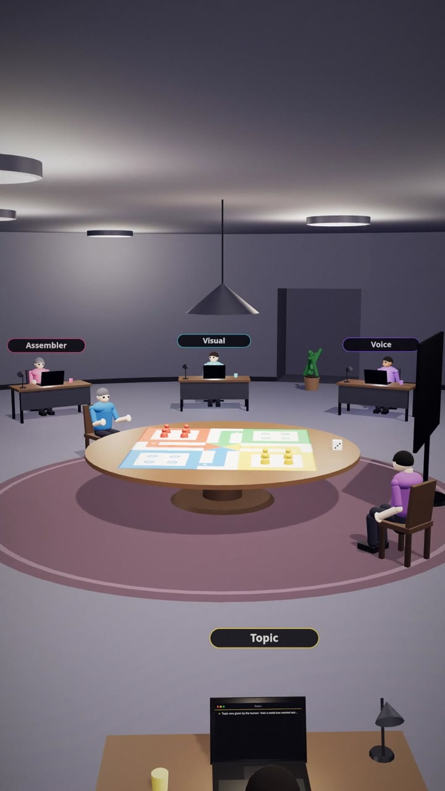
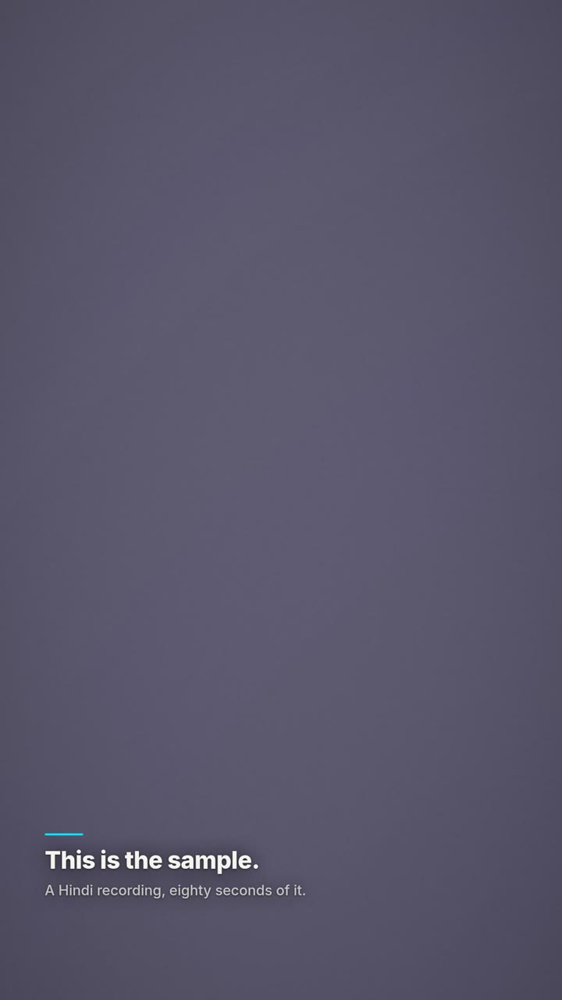
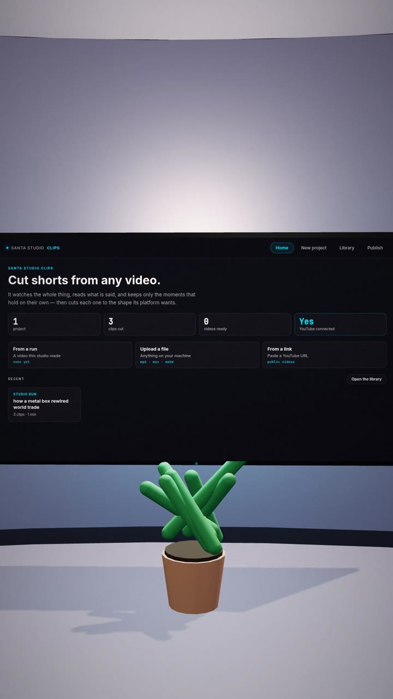
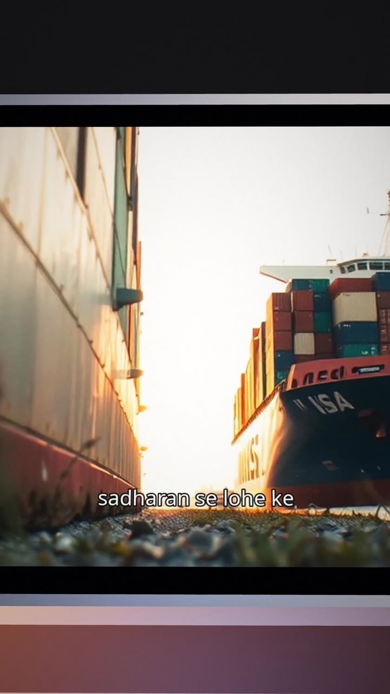

<div align="center">
  

  # Santa Studio

  **Give it a topic. Get back a finished, narrated, captioned video — with sources you can click.**

  
  
  
</div>

---

## See it work

A three minute demo, filmed inside the product. Everything on screen is real:
the studio is the app's own 3D room, the video played back near the end is one
the pipeline produced while the demo was being filmed, and the clips on the
television were cut from that video.

**▶ [Watch the demo](https://youtu.be/dtyUJxdj60c)**

| | |
|---|---|
|  |  |
| The studio, lit. Every stage of the pipeline has a desk. | A desk while a run is going, showing that agent's own work. |
|  |  |
| The recording booth, with a door. Eight seconds is a voice. | The television, running the clips app on real output. |



*The video the pipeline made, played back on the machine the demo opened on —
narrated in a cloned Hindi voice, captioned, graded and sourced.*

The film is built by the recorders and editor in [`reel/`](reel/README.md).
Nothing in it is a screen recording.

---

## What it does

You give it a subject — or let it find one people are actually reading about
this week. It researches the subject properly, checks the claims against the
sources that made them, writes a script, narrates it in your own cloned voice,
finds or generates the footage, cuts the video, burns in captions, cuts the
shorts, makes thumbnails, and hands you the file.

You are asked to approve only where it matters. Everything else runs on its own.

It is built to run on **free tiers**, and to stay usable for a channel you
intend to monetize: the footage is commercially licensed or generated, and the
default voice model is MIT.

## What you get out of it

Every finished run leaves you with:

- **The video** — 1080p, narrated, captioned, mixed to −14 LUFS
- **Shorts** — vertical cuts formatted for YouTube Shorts, Reels and Twitter
- **Thumbnails** — several variants with hook text, to pick from
- **`sources.md`** — every source, the claims drawn from it, and separately the
  claims that were flagged and kept *out* of the script
- **The timeline** — the whole edit as a file you can adjust and re-render
  without spending a single API call

## Features

**Research that goes looking.** The researcher writes its own search queries,
reads what comes back, and searches again from what it learned — because a
video title is not a search term, and handing one to an index returns
confident answers about the wrong subject. Four sources of material, none of
which needs a key: the open web, Wikipedia for the shape of a subject,
OpenAlex for the academic record with DOIs, GDELT for contemporary coverage.
The pages that matter are opened and read in full, not skimmed off a search
snippet.

**Sources you can check.** Every result is screened against the subject before
it counts, so a paper that merely shares a word with your topic never becomes
a citation. The sources in the description are the ones actually fetched,
never ones a model wrote. Where two sources disagree on a figure, the video
says they disagree instead of quietly picking one. Nothing that fails
fact-checking reaches the script — and `sources.md` is checked against the
narration that shipped, so if something slipped through, the document says so
rather than claiming an omission that never happened.

**Learns the channel you point it at.** Give it a reference video or channel
and it reads the real thing — the actual length, the actual transcript — and
measures the pace it is narrated at. That becomes a style profile: how long a
shot holds, how much the camera moves, how dense the graphics are, the mood the
music walks through. The writer is told the shape too — how the hook is built,
how sections are ordered, what stance the channel takes. Structure and pacing
only; never a fact, never a phrase.

**Your own voice.** Clone it once from about eight seconds of audio, with six
mood filters to choose from, and reuse the profile on every run. Captions are
timed against the audio that ships, which is what makes Hinglish work.

**Footage that is actually of the subject.** Pexels, then Pixabay, then
Wikimedia Commons — each result checked against what the script asked for,
because stock libraries return *something* for every query and it is often
about something else entirely. What no library carries is generated instead.

**Generated stills that look photographed.** Each one is given a real camera
brief — a film stock, a lens, a light, a flaw — several are made and the best
kept, and the result is finished to sit beside filmed footage. Documents,
charts and maps are **refused** rather than generated, because what comes back
is invented paperwork with garbled writing on it, and a fake official record
has no place in a video that promises checkable sources.

**Stills that move like scenes.** A depth map lets the near parts of a picture
cross the frame faster than the far parts, so a photograph reads as a space the
camera is moving through rather than a card being slid about.

**One look over the whole video.** Stock footage, generated stills and archive
photographs all arrive looking different from each other, and that — more than
the cuts — is what makes an edit feel stuck together. Everything is graded to
one look at the end.

**Charts from your own numbers.** Where the research turns up figures that can
honestly be compared, a chart is built from them and its bars grow into place.
Where they cannot be compared, none is drawn.

**Shorts, as their own product.** The television on the studio wall runs a
clips app: bring in a finished run, a file or a YouTube link, and it watches
the whole thing, keeps only the moments that hold on their own — ranked, each
with the reason it was kept — cuts them to the size every platform wants, and
publishes or schedules them straight to YouTube.

**Three ways to drive it.** A web app, a Telegram bot, and a 3D studio room
where you watch each agent work at its desk, write the brief on the board,
record in the booth, and cut shorts on the television. The command line is
still there for scripting.

**It survives being interrupted.** State is written after every stage. A killed
run resumes exactly where it stopped. A run that ran out of a provider's daily
allowance parks and says when to come back, instead of reporting a failure.

## Getting it running

You need Python 3.11 or newer. Nothing else has to be installed system-wide —
FFmpeg comes in through pip.

```bash
git clone https://github.com/shivamm-shukla/santa-studio
cd santa-studio
python3 -m venv venv && source venv/bin/activate
pip install -r requirements.txt
cp .env.example .env
```

### Keys

Open `.env` and add **at least one LLM key**. All four are free and none asks
for a card:

| Key | Where | Free tier |
|---|---|---|
| `GEMINI_API_KEY` | [aistudio.google.com](https://aistudio.google.com) | requests/day |
| `GROQ_API_KEY` | [console.groq.com](https://console.groq.com) | requests/day, very fast |
| `CEREBRAS_API_KEY` | [cloud.cerebras.ai](https://cloud.cerebras.ai) | tokens/day |
| `OPENROUTER_API_KEY` | [openrouter.ai/keys](https://openrouter.ai/keys) | several free models |

More keys is better — when one runs out for the day the next one picks the run
up instead of stalling it.

**For footage**, `PEXELS_API_KEY` ([pexels.com/api](https://www.pexels.com/api/))
and `PIXABAY_API_KEY` ([pixabay.com/api/docs](https://pixabay.com/api/docs)) are
free. Without them only Wikimedia Commons is available and the footage is
thinner.

**For generated stills**, a free Cloudflare account gives you the best of them:

| Key | Where |
|---|---|
| `CLOUDFLARE_ACCOUNT_ID` | [dash.cloudflare.com](https://dash.cloudflare.com) → Workers & Pages |
| `CLOUDFLARE_API_TOKEN` | same dashboard → API Tokens, with Workers AI read |

10,000 neurons a day, shared across everything you use it for — roughly a
hundred images, or fewer if you also caption through it. Without it, generation
falls back to a keyless service whose results are noticeably weaker.

### Check the machine is ready

```bash
python studio.py doctor
```

The fastest way to find out what will and will not work. It checks Python,
FFmpeg, fonts, libraries, keys, remaining daily quota and free disk — and every
failing check prints the fix beside it.

On Linux, for Hindi or Hinglish videos, install a Devanagari font or captions
render as empty boxes:

```bash
sudo apt install fonts-noto-devanagari     # Debian/Ubuntu
sudo pacman -S noto-fonts                  # Arch
```

### Disk

Budget about **5 GB free**. A run needs room to work, each finished video is
around 60 MB, and the depth and caption models are a few hundred megabytes
between them. `python studio.py doctor` tells you what you have.

### Start it

| | |
|---|---|
| **Web app** | `uvicorn web.server:app --reload` → `localhost:8000` |
| **The room** | `cd room && npm install && npm run dev` (with the web app running) |
| **CLI** | `python main.py` |
| **Telegram bot** | `python bot_main.py` — needs `TELEGRAM_BOT_TOKEN` and `TELEGRAM_CHAT_ID` |

Every provider fails cleanly with a readable error when its key is missing, so
voice, captions and assembly are all testable before you add anything.

## Choosing a voice

`ACTIVE_PROVIDERS["voice"]` picks between three very different things:

| | `gtts` (default) | `chatterbox` | `xtts` |
|---|---|---|---|
| Clones your voice | no — one fixed voice | yes, from ~8s | yes, from ~6s |
| Setup | none | model downloads on first run | `pip install 'coqui-tts[codec]'` + ~1.9 GB |
| Licence | free to use | **MIT** | **CPML — non-commercial only** |

`gtts` is the default because it is the only one that works straight out of
`pip install -r requirements.txt`. It ignores voice samples entirely.

**`chatterbox` is the one to use on a channel you intend to monetize** — MIT
weights, so nothing about the licence constrains what you do with the output.
It is not the default only because it downloads a model on first use and is
slow on a CPU-only machine.

`xtts` also clones, but its weights forbid commercial use, and a monetized
channel counts. Set `COQUI_TOS_AGREED=1` to record agreement before using it.

Any interface falls back to `gtts` when a run has no voice to clone from,
rather than halting.

## Where your files go

Nothing is written into the project folder. Everything lands in one place
outside it, so you can move or delete the checkout without losing your work:

| Linux | macOS | Windows |
|---|---|---|
| `~/.local/share/santa-studio` | `~/Library/Application Support/SantaStudio` | `%LOCALAPPDATA%\SantaStudio` |

Set `SANTA_STUDIO_HOME` in `.env` to put it elsewhere — an external drive, for
instance, since video adds up quickly.

It is laid out by how disposable things are:

```
projects/   one folder per video: state, timeline, voice, output   keep
library/    voice profiles and style profiles                      keep
cache/      downloaded footage, music, models                      safe to delete
config/     API credentials                                        secret
tmp/        scratch, cleared on startup                            safe to delete
```

Projects are named `2026-08-27_how-a-metal-box-rewired-world-trade_95cdd697`, so a
plain directory listing is in date order and you can find one by reading it.

### Housekeeping

```bash
python studio.py where              # every path, with its size
python studio.py ls                 # your projects: date, topic, state, size
python studio.py rm <project>       # delete one project
python studio.py clean --orphans    # only footage no project still needs
python studio.py clean --cache      # reclaim space; nothing precious is touched
python studio.py gc --keep 10       # keep the 10 most recent projects
python studio.py export <project>   # zip one up, credentials excluded
```

`<project>` can be an id fragment, a directory name, or part of the topic. A run
that is still in flight is never collected.

## Running the tests

```bash
pip install pytest
python -m pytest
```

No test calls a live API, downloads anything, or writes outside its own
temporary directory, so the suite runs on a machine with no keys configured.

## Known limits

- **YouTube upload has never run against a live account.** The code path is
  complete and exercised in dry-run, and connecting an account is what turns
  publishing on. Until Google verifies the project, uploads are forced to
  `private`.
- **Rendering is CPU-bound and slow.** Expect several minutes for a two-minute
  video, more with depth-driven motion on many stills.
- **A day's free allowance is smaller than it looks.** A run costs roughly ten
  LLM calls; deep research costs more. Gemini's free tier is twenty requests a
  day per model. Configure more than one key — the router moves to the next
  provider rather than stopping, and a run that genuinely runs out parks and
  says when to come back instead of failing.
- **A long video is a decision, not a default.** `VIDEO_LENGTH_MINUTES` sets
  how long a run aims for and ships at five. Above six the script is planned
  as chapters and written one chapter at a time — which is what makes a long
  video actually arrive at its length, and is also why it is not the default:
  it costs a request per chapter on top of the outline, and research goes
  correspondingly deeper. At fifteen or twenty minutes, budget several
  providers' allowances for one run.
- **Cloning quality depends on your sample.** The repair chain helps a bad mic;
  it cannot invent what was never recorded.
- **Generated images are capped by the free tier.** Ten thousand neurons a day
  is roughly a hundred images; past that, generation falls back to a weaker
  keyless service and the run says so in its log.

## Using it, and using it commercially

Anyone can run this and make videos with it. Videos carry a small mark in the
corner naming Santa Studio.

Putting those videos on a channel you earn from needs a commercial grant, and
**any accepted contribution earns you a permanent one**. It does not have to be
code: a typo fix in the documentation counts, so does a bug report that turns
out to be real, so does correcting an explanation that reads badly. There is no
minimum size. [CONTRIBUTING.md](CONTRIBUTING.md) walks through making a first
contribution from scratch, for people who have never contributed to anything
before.

A grant is a signed file; installing it turns the mark off:

```bash
python studio.py licence                 # what this machine is allowed to do
python studio.py licence grant.json      # install one
```

This is a source-available licence, not an open source one - it restricts
commercial use, which the Open Source Definition does not permit. The full
terms are in [LICENSE](LICENSE), and they are written in plain English.

For non-commercial use the mark is a courtesy, not an obligation: remove it if
you like. For commercial use you may not, and that line is the licence's, not
the code's - the mark can be removed by anyone willing to edit the source,
because this runs on your machine from source you can read, and no check
written here could survive that. The name and the logo are trademarks, which
no licence here grants you: a fork is welcome, a fork calling itself Santa
Studio is not.

## Documentation

| | |
|---|---|
| [docs/SPEC.md](docs/SPEC.md) | What it is meant to do, and an honest status for every claim |
| [docs/ARCHITECTURE.md](docs/ARCHITECTURE.md) | How it is built and why |
| [docs/ROADMAP.md](docs/ROADMAP.md) | The engineering plan and what each phase delivered |
| [reel/README.md](reel/README.md) | How the demo film is built, and what it cost to learn |
| [CONTRIBUTING.md](CONTRIBUTING.md) | How to contribute, from scratch — no prior experience assumed |
| [LICENSE](LICENSE) | What you may do with this, and how to earn commercial rights |
| [CODE_OF_CONDUCT.md](CODE_OF_CONDUCT.md) | How people here treat each other |
| [SECURITY.md](SECURITY.md) | Reporting a vulnerability, and what counts as one |

---

<div align="center"><sub>Built solo, end to end — architecture, backend, and frontend.</sub></div>
